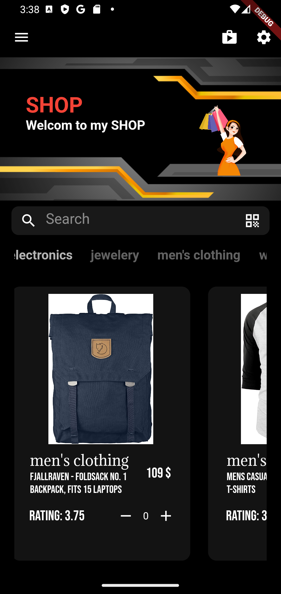
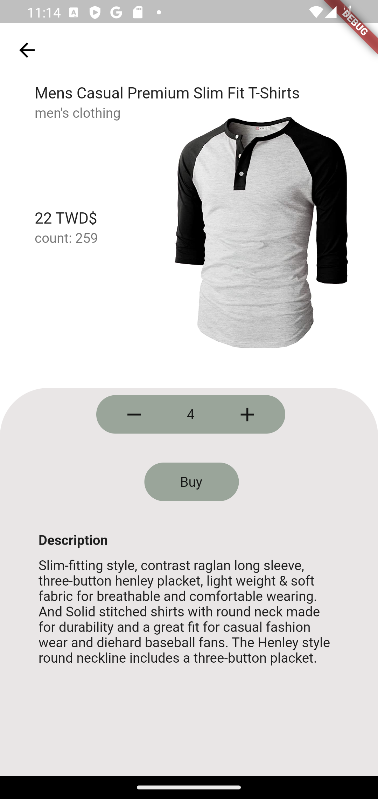

# storeappver3

- A new Flutter side project that learn design pattern.
- flutter that learns to design patterns and API、SQL、StateManagement.
- All images are quoted.
- The shop databases on the Fake Store API website, can fetch data through API.

## working...productDetail, 

